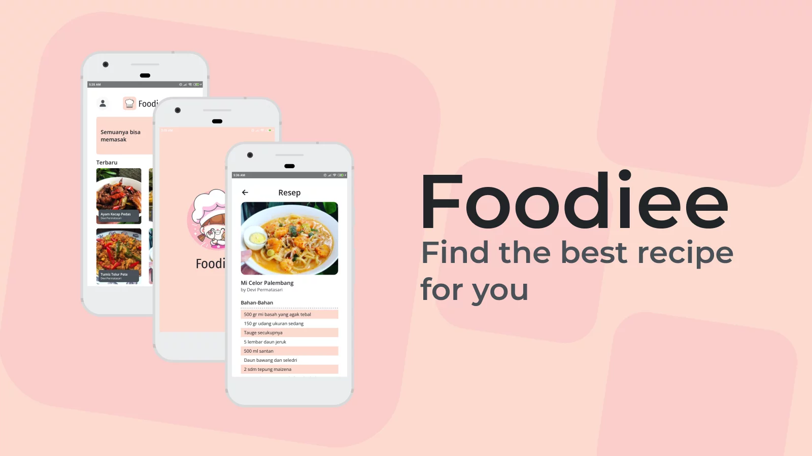

## About Project



A simple application of Indonesian food recipes. You can bookmark recipes when you are logged in. This app implements Firebase Firestore & Firebase Authentication.

For cartoon assets it comes from [Freepik](https://www.freepik.com/) and for icons it comes from [SVGRepo](https://svgrepo.com/).

### JSON Firestore Structure

```JSON
{
  "Recipes": [
    {
      "id": "",
      "data": {
        "image": "",
        "ingredients": "",
        "method": "",
        "publisher": "",
        "searchTitle": "",
        "title": "",
      },
    },
  ],
  "RecipeCollection": [
    {
      "id": "",
      "data": {
        "recipeId": "",
        "userId": "",
      },
    }
  ],
}
```

### Built With

[](https://reactnative.dev/)
[](https://firebase.google.com/)

## License

Distributed under the MIT License. See [LICENSE](LICENSE) for more information.
